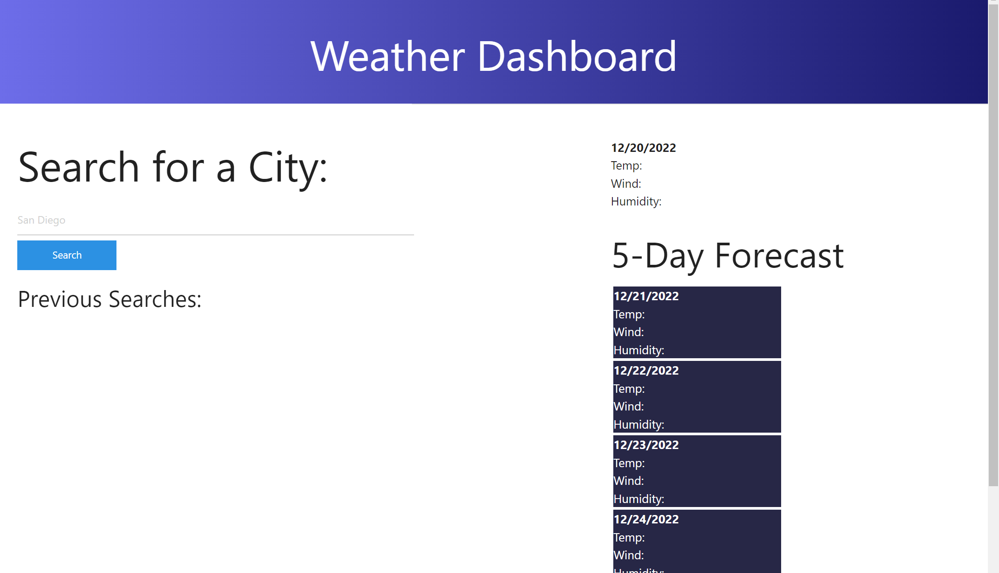
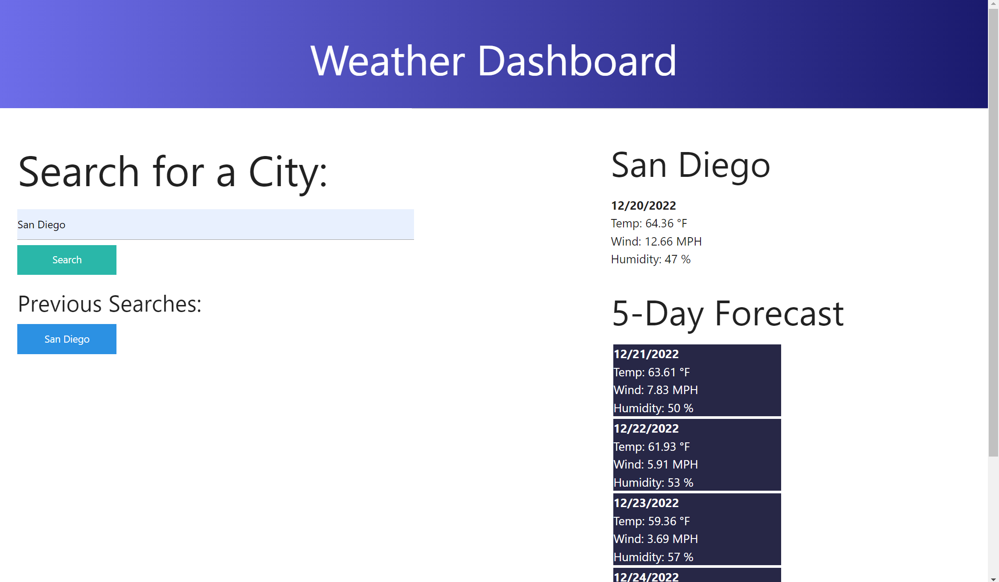

# KS-Weather-Tracker

## Description

This website is a wather app that allows users to type in any city and recieve information back about the current weather situation, as well as an upcoming forecast for the next 5 days. Using an API, this application is able to pull the current temperature, wind speed, and humidity and display it for the user to see. Below, it will also display the predicted forecast for the next 5 days. Students had to test their skills of HTML, CSS, Javascript, as well as fetching data from API's to sucessfully finish this project.

## Instaliation

N/A

## Usage

https://ksteed8859.github.io/KS-Weather-Tracker/

When first loaded, the website will display a search bar for users to enter what city they'd like to search. After pressing either the search button or the enter key, the website will display both the current and future forecast for that city. The searched city will be entered into a "previous searches" area, however it is not functional yet.

## Credits

Open Weather Map API's:
    Current Weather Data: https://openweathermap.org/current
    5 Day/3 Hour Forecast: https://openweathermap.org/forecast5

## License

N/A

